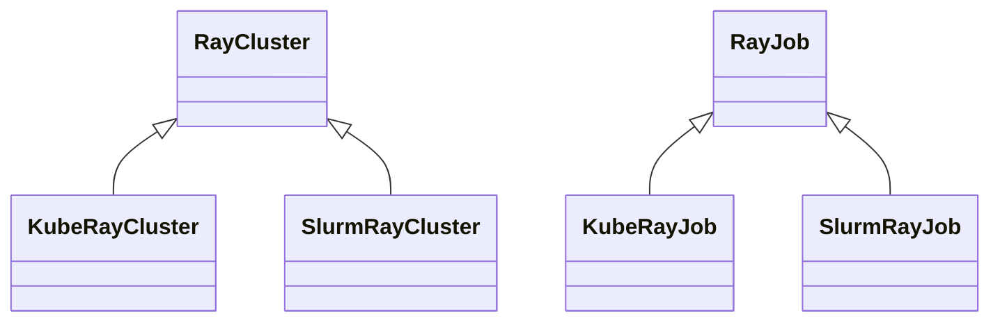

# Ray Clusters & Jobs

> **Audience**: You already know how to configure executors with NeMo-Run and want distributed *Ray* on either Kubernetes **or** Slurm.
>
> **TL;DR**: `RayCluster` manages the _cluster_; `RayJob` submits a job with an ephemeral cluster.  Everything else is syntactic sugar.

## RayCluster vs. RayJob – which one do I need?

| Aspect | RayCluster (interactive) | RayJob (batch) |
|--------|--------------------------|----------------|
| Cluster lifetime | Remains until you call `.stop()` | Ephemeral – cluster auto-deletes after the job finishes |
| Spin-up cost per run | Paid **once** (reuse for many jobs) | Paid **per** submission |
| Multiple jobs on same cluster | Yes | No (one job per submission) |
| Dashboard access | `.port_forward()` to open | Not exposed by default |
| Best for | Debugging, notebooks, iterative dev, hyper-param sweeps that reuse workers | CI/CD pipelines, scheduled training/eval, one-off runs |
| Resource efficiency | Great when you launch many jobs interactively | Great when you just need results & want resources freed asap |

**Rules of thumb**

• Pick **RayCluster** when you want a long-lived playground: start it once, poke around with the Ray CLI or a Jupyter notebook, submit multiple Ray Jobs yourself, and tear it down when you're done.

• Pick **RayJob** when you simply need *"run this script with N GPUs and tell me when you're done"* – the backend spins up a transient cluster, runs the entrypoint, collects logs/status, and cleans everything up automatically.

## 1.  Mental model

| Object      | What it abstracts | Back-ends supported |
|-------------|-------------------|---------------------|
| `run.ray.cluster.RayCluster` | Lifecycle of a Ray **cluster** (create ⇒ wait ⇢ status ⇢ port-forward ⇢ delete). | `KubeRayExecutor`, `SlurmExecutor` |
| `run.ray.job.RayJob`         | Lifecycle of a Ray **job**   (submit ⇒ monitor ⇢ logs ⇢ cancel). | same |

The two helpers share a uniform API; the chosen *Executor* decides whether we talk to the **KubeRay** operator (K8s) or a **Slurm** job under the hood.



## 2.  KubeRay quick-start

```python
from nemo_run.core.execution.kuberay import KubeRayExecutor, KubeRayWorkerGroup
from nemo_run.run.ray.cluster import RayCluster
from nemo_run.run.ray.job import RayJob

# 1) Configure a KubeRay executor (resources + cluster policy)
executor = KubeRayExecutor(
    namespace="my-k8s-namespace",
    ray_version="2.43.0",
    image="anyscale/ray:2.43.0-py312-cu125",
    head_cpu="4",
    head_memory="12Gi",
    worker_groups=[
        KubeRayWorkerGroup(
            group_name="worker",        # arbitrary string
            replicas=2,                  # two worker pods
            gpus_per_worker=8,
        )
    ],
    # Optional tweaks ----------------------------------------------------
    reuse_volumes_in_worker_groups=True,          # mount PVCs on workers too
    spec_kwargs={"schedulerName": "runai-scheduler"},  # e.g. Run:ai
    volume_mounts=[{"name": "workspace", "mountPath": "/workspace"}],
    volumes=[{
        "name": "workspace",
        "persistentVolumeClaim": {"claimName": "my-workspace-pvc"},
    }],
    env_vars={
        "UV_PROJECT_ENVIRONMENT": "/home/ray/venvs/driver",
        "NEMO_RL_VENV_DIR": "/home/ray/venvs",
        "HF_HOME": "/workspace/hf_cache",
    },
    container_kwargs={
        "securityContext": {
            "allowPrivilegeEscalation": False,
            "runAsUser": 0,
        }
    },
)

# 2) Commands executed in EVERY Ray container before the daemon starts
pre_ray_start = [
    "pip install uv",
    "echo 'unset RAY_RUNTIME_ENV_HOOK' >> /home/ray/.bashrc",
]

# 3) Spin-up the cluster & expose the dashboard
cluster = RayCluster(name="demo-kuberay-cluster", executor=executor)
cluster.start(timeout=900, pre_ray_start_commands=pre_ray_start)
cluster.port_forward(port=8265, target_port=8265, wait=False)  # dashboard → http://localhost:8265

# 4) Submit a Ray Job that runs inside that cluster
job = RayJob(name="demo-kuberay-job", executor=executor)
job.start(
    command="uv run python examples/train.py --config cfgs/train.yaml",
    workdir="/path/to/project/",                # synced to PVC automatically
    runtime_env_yaml="/path/to/runtime_env.yaml",  # optional
    pre_ray_start_commands=pre_ray_start,
)
job.logs(follow=True)

# 5) Clean-up
cluster.stop()
```

### Notes
1. `workdir` is rsync'ed into the first declared `volume_mounts` on the executor, so relative imports *just work*.
2. Add `pre_ray_start_commands=["apt-get update && …"]` to inject shell snippets that run inside the **head** and **worker** containers **before** Ray starts.

## 3.  Slurm quick-start

```python
import os
from pathlib import Path

import nemo_run as run
from nemo_run.core.execution.slurm import SlurmExecutor, SlurmJobDetails, SSHTunnel
from nemo_run.run.ray.cluster import RayCluster
from nemo_run.run.ray.job import RayJob

# 1) SSH tunnel to the Slurm login node so we can launch remotely
ssh = SSHTunnel(
    host="login.my-hpc.com",      # public hostname of login node
    user="jdoe",                  # your cluster username
    job_dir="/scratch/jdoe/runs", # where NeMo-Run stores Ray artefacts like logs, code, etc.
    identity="~/.ssh/id_ed25519", # optional SSH key
)

# 2) Create a Slurm executor and tweak defaults
executor = SlurmExecutor(
    account="gpu-dept",
    partition="a100",
    nodes=2,
    gpus_per_node=8,
    gres="gpu:8",
    time="04:00:00",
    container_image="nvcr.io/nvidia/pytorch:24.05-py3",
    container_mounts=["/scratch:/scratch"],
    env_vars={"HF_HOME": "/scratch/hf_cache"},
    tunnel=ssh,
)

# Optional: customise where Slurm writes stdout/err
class CustomJobDetails(SlurmJobDetails):
    @property
    def stdout(self) -> Path:  # noqa: D401 – illustrative only
        assert self.folder
        return Path(self.folder) / "sbatch_stdout.out" # Will write sbatch output here.

    @property
    def stderr(self) -> Path:  # noqa: D401
        assert self.folder
        return Path(self.folder) / "sbatch_stderr.err"

executor.job_details = CustomJobDetails()

# 3) Commands executed on every node right before Ray starts
pre_ray_start = [
    "pip install uv",
]

# 4) Bring up the Ray cluster (Slurm array job under the hood)
cluster = RayCluster(name="demo-slurm-ray", executor=executor)
cluster.start(timeout=1800, pre_ray_start_commands=pre_ray_start)
cluster.port_forward(port=8265, target_port=8265)  # dashboard → http://localhost:8265

# 5) Submit a Ray job that runs inside the cluster
job = RayJob(name="demo-slurm-job", executor=executor)
job.start(
    command="uv run python train.py --config cfgs/train.yaml cluster.num_nodes=2",
    workdir="/path/to/project/",   # rsync'ed via SSH to the cluster_dir/code/
    pre_ray_start_commands=pre_ray_start,
)
job.logs(follow=True)

# 6) Tear everything down (or just let the wall-time expire)
cluster.stop()
```

### Tips for Slurm users
* `executor.packager = run.GitArchivePackager()` if you prefer packaging a git tree instead of rsync.
* `cluster.port_forward()` opens an SSH tunnel from *your laptop* to the Ray dashboard running on the head node.

## 4.  API reference cheat-sheet

```python
cluster = RayCluster(name, executor)
cluster.start(wait_until_ready=True, timeout=600, pre_ray_start_commands=["pip install -r …"])
cluster.status(display=True)
cluster.port_forward(port=8265, target_port=8265, wait=False)
cluster.stop()

job = RayJob(name, executor)
job.start(command, workdir, runtime_env_yaml=None, pre_ray_start_commands=None)
job.status()
job.logs(follow=True)
job.stop()
```

All methods are synchronous and **return immediately** when their work is done; the helpers hide the messy details (kubectl, squeue, ssh, …).

## 5.  Rolling your own CLI

Because `RayCluster` and `RayJob` are plain Python, you can compose them inside **argparse**, **Typer**, **Click** – anything. Here is a minimal **argparse** script:

```python
import argparse
from nemo_run.core.execution.kuberay import KubeRayExecutor, KubeRayWorkerGroup
from nemo_run.run.ray.cluster import RayCluster
from nemo_run.run.ray.job import RayJob


def main() -> None:
    parser = argparse.ArgumentParser(description="Submit a Ray job via NeMo-Run")
    parser.add_argument("--name", default="demo", help="Base name for cluster + job")
    parser.add_argument(
        "--image",
        default="anyscale/ray:2.43.0-py312-cu125",
        help="Ray container image",
    )
    parser.add_argument(
        "--command",
        default="python script.py",
        help="Entrypoint to execute inside Ray job",
    )
    args = parser.parse_args()

    # 1) Build the executor programmatically
    executor = KubeRayExecutor(
        namespace="ml-team",
        ray_version="2.43.0",
        image=args.image,
        worker_groups=[KubeRayWorkerGroup(group_name="worker", replicas=1, gpus_per_worker=8)],
    )

    # 2) Spin up a cluster and keep it for the lifetime of the script
    cluster = RayCluster(name=f"{args.name}-cluster", executor=executor)
    cluster.start()

    # 3) Submit a job against that cluster
    job = RayJob(name=f"{args.name}-job", executor=executor)
    job.start(command=args.command, workdir="./")

    # 4) Stream logs and block until completion
    job.logs(follow=True)

    # 5) Tidy-up
    cluster.stop()


if __name__ == "__main__":
    main()
```

From there you can wrap the script with `uvx`, bake it into a Docker image, or integrate it into a larger orchestration system – the underlying NeMo-Run APIs stay the same.

---

Happy distributed hacking! 🚀
